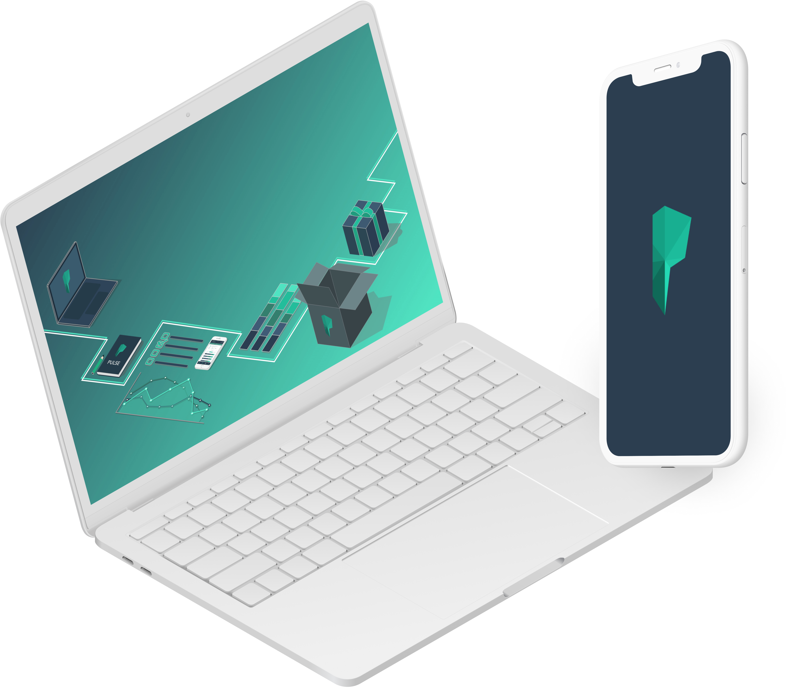

# College Pulse

##### Sept 2017 - Jun 2018 • Freelance • Full Stack Web Engineer

[Pulse](https://collegepulse.com/) was the first project that 
I worked with title Full Stack Web Engineer. This was during 
the time I was a member of the [DALI Lab](https://dali.dartmouth.edu) 
at [Dartmouth College](https://dartmouth.edu).

## Anonymous Surveys
[Terren Klein](https://www.linkedin.com/in/terrenklein/) was the 
mind behind creating the idea of collecting college students' opinions 
by creating an anonymous survey/data-collection platforms. At the 
time, I was a rising junior that wanted to get more hands-on 
experience in the world of web development. So through the DALI 
Lab, I was placed on the team for the entire academic year.

Because I was a very junior developer with only one summer 
internship experience, my Project Manager made sure that the 
tickets I was given were understandable and achieveable but also 
were challenging and engaging.

The majority of my work during the first two terms on the team 
was geared toward front end work. Adding responsiveness to the 
platform's graphs and charts, updating fonts, and creating 
reliable unit tests.

During the last term on the project, I was given back end tasks. 
Though these tickets were small, they forced me to think in a 
pragmatic and scalable way.

## Tech
The web app uses **React** as the front end framework, **MongoDB** 
as the database language, **Redis** for caching, and **Redux** 
for data management.

## End Goal
The purpose for me joing this team was to get experience working 
on a pre-existing codebase as well work with more knowledge engineers. 
After my year on the project was finished, I felt like I gained the 
skills that I was looking for. College Pulse is still going strong! 
You can check out their current iteration [here](https://collegepulse.com/).
