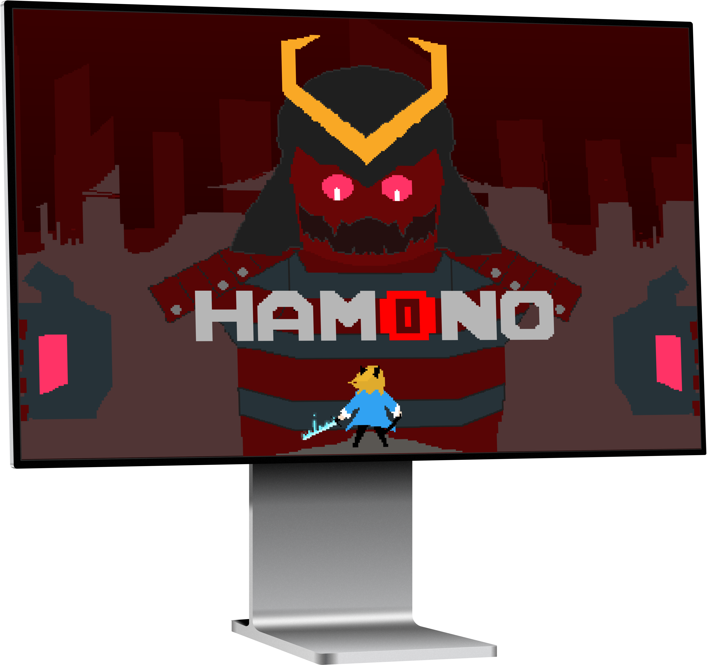

# Hamono

##### Nov 2017 - Jan 2018 • Personal • Game Developer

One of the great things about being a college students is 
the long breaks. Dartmouth College was generous by having 
a six-week long winter break. Instead of letting those six 
weeks aimlessly pass by, a few friends decided to make a 
desktop game, ultimately called 
[Hamono](https://hamono.surge.sh).

## A Click-and-Drag Game
All of us loved playing video games, and realized that we 
could work together to make our own. There was five us in 
total:

Two designers: [Young Jang](https://www.linkedin.com/in/youngjang19/) 
and [Lauren Gray](https://www.linkedin.com/in/lauren-gray-459988161/)

Two developers: [Josiah Putman](https://www.linkedin.com/in/josiah-putman-77b25a127/) 
and me

One musical composer: [Summer Cody](https://www.linkedin.com/in/summercody/)

Our main focus of this project was to create something that 
was exciting but also manageable for a six-week time period. 
Within our break, we wanted to create a simple story line, a
variety of enemies, two levels, and one boss level.

## Design
The designers wanted to have a pixel art aesthetic, so the 
main tool that they used to create characters and their 
animations was [Aseprite](https://www.aseprite.org/).

Before they designed the main character and her enemies, 
they wanted to know what the game mechanics were. Did we 
want the user to use their keyboard, a joystick, a touchscreen? 
After a few hours of brainstorming, we came up with the idea 
of having a click-and-drag experience.

With this mechanic in mind, the enemy characters had targets 
on different parts of their bodies. So the user had to make sure 
that they were clicking-and-dragging (or slashing) in the right 
direction. We thought this made for a more engaging gaming 
experience.

## Tech
We used the game engine [Unity](https://unity.com) to create 
the game. For the programming language, we went with **C#** 
because we found the documentation provided by Unity and the 
support from the game development community was stronger. 

Here's the [source code](https://github.com/Katsutoshii/Hamono).

## End Goal
We set out to make a game that we would enjoy playing. In the 
end, we created a game, though with bugs, was not only enjoyable 
but memorable. This was our first game; we learned a lot about the 
process in just six weeks.
