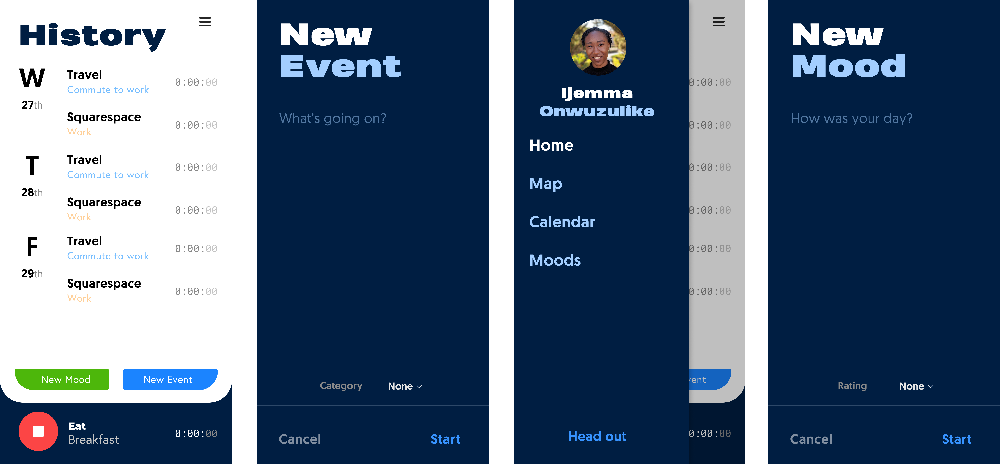

# Timetracker

##### Jun 2019 - Present • Personal • Full Stack Mobile Engineer

After graduation, I had a lot of spare time on my hands and was 
looking for something to fill my time. I didn't want to think 
of a ground breaking app to get overly invested. Instead, I wanted 
start a project that was small, manangeable, but still served a 
purpose for me.

## Tracking Personal Time
The first week of post grad-life was slow. I was waiting to start my
first job as a Front End Software Engineer in New York. So, I 
passed the time watching TV and YouTube videos. After the week 
passed, my initial excitement to catch up on missed TV turned into 
sluggishness and guilt.

I came across two YouTube videos, one by 
[Kurtis Baute](https://www.youtube.com/watch?v=0tnX81N6Ris&t=209s) and 
another by [Nathaniel Drew](https://www.youtube.com/watch?v=0tnX81N6Ris&t=209s).

Though these two videos had two different motives of tracking personal 
time, they both had similar benefits of having a better sense of how they 
were ultimately spending their time.

These videos inspired to start tracking my own time. But, instead of 
downloading app I decided to take the opportunity get back into mobile 
development.

## Design
If there's one thing that I've learned as a software engineer over the 
years is that designing the product uncovers possible pitfalls during 
development.

The first version of the application was simple: allow the user to track 
an event that falls under a category with a description attached.

## Tech
The mobile app is developed using **React Native** as the front end 
framework and **MongoDB** as the database language.

## End Goal
Timetracker is a personal passion project that aims to give me the space 
to learn and grow as a software engineer. As time goes on and new ideas 
come to me, I'll slowly expand the functionality and capabilities of 
the app.
